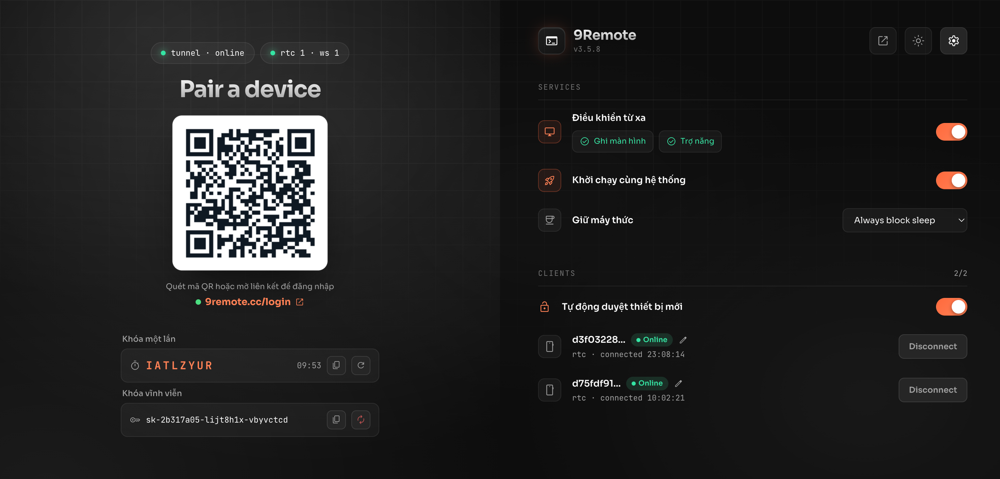

<div align="center">
  

  # 9Remote — Code Ở Bất Kỳ Đâu Trên Trái Đất

  **Toàn bộ cỗ máy dev của bạn, nay nằm gọn trong túi quần.**<br/>
  **Remote IDE, Remote Desktop, File Explorer, Mobile Emulator và Localhost Preview — tối ưu siêu mượt cho mobile với WebRTC độ trễ cực thấp.**

  [](https://www.npmjs.com/package/9remote)
  [](https://www.npmjs.com/package/9remote)
  [](#-giấy-phép)

  [🚀 Bắt đầu nhanh](#-bắt-đầu-nhanh) • [✨ Siêu năng lực](#-5-siêu-năng-lực-remote--tối-ưu-mobile) • [📊 So sánh](#-bảng-so-sánh-tính-năng) • [🌐 Website](https://9remote.cc) • [📖 Tài liệu](https://docs.9remote.cc)

  [🇺🇸 English](../README.md) • [🇻🇳 Tiếng Việt](./README.vi.md)
</div>

---

## ⚡ Bắt Đầu Nhanh

Khởi động không gian làm việc từ xa chỉ trong **30 giây** với một câu lệnh duy nhất trên máy tính của bạn:

```bash
npx 9remote
```

*Hoặc cài đặt toàn cục:*
```bash
npm install -g 9remote
9remote
```

🎉 **Quét mã QR bằng camera điện thoại (hoặc mở đường link trên bất kỳ trình duyệt nào) → bấm "Approve" trên máy tính → bạn đã kết nối thành công!**

> **Hỗ trợ macOS, Linux và Windows.** Yêu cầu Node.js 18+.  
> Không cần cấu hình mạng. Không cần mở port modem. Không cần đăng ký tài khoản.

### Các Chế Độ CLI

| Lệnh | Chế độ | Mô tả |
|------|--------|-------|
| `9remote` | **TUI Mode** | Giao diện tương tác terminal kèm mã QR |
| `9remote ui` | **Web UI Mode** | Mở bảng điều khiển cục bộ tại `localhost:2208` |

---

## ✨ 5 Siêu Năng Lực Remote + Tối Ưu Mobile

### 💻 1. Remote IDE & AI Agent Workspace
- Terminal chia nhiều cột (multi-pane), kéo thả thay đổi kích thước mượt mà.
- Trình soạn thảo Code Editor tích hợp sẵn kèm cây thư mục.
- Xem trạng thái Git, duyệt Git Diff trực quan và chuyển đổi Git Worktree nhanh chóng.
- Tự động mở panel xem Artifact (HTML, Markdown, Mermaid) cho **Claude Code**, Codex và các AI agent.

### 📱 2. Code on Mobile, Web & Any Screen (Mobile Full Feature)
- Hàng phím lập trình viên chuyên dụng (`Esc`, `Tab`, `Ctrl`, `Alt`, phím điều hướng).
- Phím tắt AI tùy chỉnh và cử chỉ vuốt chuyển phiên làm việc tự nhiên.
- Rung phản hồi xúc giác (haptic touch) khi gõ phím.
- Giao diện tự thích ứng: IDE đa cột trên Desktop/iPad, dạng thẻ tiện lợi trên Mobile.

### 🖥️ 3. Instant Remote Desktop (WebRTC 60fps)
- Stream màn hình phần cứng với độ trễ siêu thấp (<20ms).
- Hỗ trợ chuột, chạm cảm ứng, bàn phím và chuyển đổi đa màn hình.
- Tiết kiệm pin và băng thông hơn rất nhiều so với VNC, AnyDesk hay TeamViewer.

### 📁 4. Remote File Explorer
- Cây thư mục trực quan, tìm kiếm file nhanh chóng.
- Kéo thả tải lên và tải xuống file an toàn qua cảm ứng.
- Bảo vệ bằng cơ chế path-jail nghiêm ngặt, giữ an toàn cho hệ thống máy chủ.

### 📱 5. Live Remote Emulator
- Stream tương tác trực tiếp cho Android Emulator và iOS Simulator.
- Chạm, vuốt và kiểm thử giao diện ứng dụng di động ngay trên trình duyệt điện thoại.

### 🌐 6. Instant Localhost Preview
- Cầu nối Service Worker tích hợp truyền thẳng `localhost:3000` hoặc `localhost:8080` về điện thoại.
- Xem trước ứng dụng web cục bộ theo thời gian thực mà không cần ngrok hay mở cổng router.

### 🔄 7. Persistent PTY Daemon
- Tiến trình ngầm giữ cho các phiên terminal và build luôn sống trên máy chủ.
- Chuyển mạng từ Wi-Fi sang 4G, khóa màn hình hay tắt trình duyệt cũng không làm gián đoạn tác vụ đang chạy.

### 🛡️ 8. Bảo Mật 3 Lớp Zero-Trust
1. **Khóa phân tách (Split-Key):** Khóa ghép nối được tách thành HEAD và TAIL; server trung gian chỉ thấy HEAD để định tuyến và không bao giờ biết TAIL bí mật.
2. **P2P WebRTC trực tiếp:** Dữ liệu truyền trực tiếp ngang hàng giữa 2 thiết bị với mã hóa X25519 + AES-256-GCM.
3. **Phê duyệt vật lý trên Host:** Thiết bị mới không thể truy cập cho đến khi bạn bấm "Approve" trên màn hình máy tính thật.

---

## 📊 Bảng So Sánh Tính Năng

| Tính năng | **9Remote** | Claude Remote | TeamViewer | Chrome Remote | Termius |
|-----------|:-----------:|:-------------:|:----------:|:-------------:|:-------:|
| **Zero Config** | ✅ | ✅ | ✅ | ✅ | ❌ |
| **Remote IDE** | ✅ | ❌ | ❌ | ❌ | ❌ |
| **Terminal Access** | ✅ | ✅ | ❌ | ❌ | ✅ |
| **Persistent Daemon** | ✅ | ✅ | ❌ | ❌ | ✅ |
| **Remote Localhost Preview** | ✅ | ❌ | ❌ | ❌ | ❌ |
| **Touch File Explorer & Editor** | ✅ | ❌ | ✅ | ❌ | ✅ |
| **Remote Desktop** | ✅ | ❌ | ✅ | ✅ | ❌ |
| **Remote Emulator** | ✅ | ❌ | ❌ | ❌ | ❌ |
| **AI Agent Artifacts** | ✅ | ✅ | ❌ | ❌ | ❌ |
| **Physical Host Approval** | ✅ | ❌ | ✅ | ❌ | ❌ |
| **Git Integration** | ✅ | ❌ | ❌ | ❌ | ❌ |
| **Mobile Optimized** | ✅ | ✅ | ❌ | ❌ | ✅ |
| **Browser-Based** | ✅ | ✅ | ❌ | ✅ | ❌ |
| **QR Login** | ✅ | ✅ | ❌ | ❌ | ❌ |
| **Auto Tunnel** | ✅ | ✅ | ✅ | ✅ | ❌ |
| **No Port Forwarding** | ✅ | ✅ | ✅ | ✅ | ❌ |
| **No Account Required** | ✅ | ❌ | ❌ | ❌ | ❌ |
| **Free & Open Source** | ✅ | ❌ | ❌ | ✅ | ❌ |
| **TỔNG CỘNG** | **18 / 18** | 10 / 18 | 6 / 18 | 5 / 18 | 5 / 18 |

> **🏆 9Remote: Giải pháp toàn diện đáp ứng 18/18 tính năng · 100% tự lưu trữ và riêng tư.**

---

## 🎯 Tình Huống Sử Dụng

- **Code ngay trên giường** — Nửa đêm phát hiện ra bug, không muốn dậy lấy laptop. Rút điện thoại ra, kết nối vào máy bàn, sửa lỗi, commit, push và ngủ ngon.
- **Xử lý sự cố ở quán cafe** — Server báo lỗi khi đang uống cà phê? Mở điện thoại, xem log terminal, chỉnh sửa file cấu hình và restart service ngay tức thì.
- **Deploy khi đang đi du lịch** — Khách hàng cần hotfix khẩn cấp? Mở điện thoại → 9Remote → `git pull` → build → deploy chỉ trong 5 phút.
- **Theo dõi AI Coding Agent** — Chạy các tác vụ dài với Claude Code / Cursor trên máy tính, theo dõi tiến độ, xem diff và duyệt artifact ngay trên điện thoại.

---

## ❓ Câu Hỏi Thường Gặp

<details>
<summary><b>🔒 9Remote có an toàn không?</b></summary>

**Có.** 9Remote áp dụng 3 lớp bảo mật Zero-Trust:
- Cloudflare Tunnel chỉ chiều đi (outbound), không cần mở cổng modem.
- Kênh truyền P2P qua WebRTC mã hóa đầu cuối.
- Bắt buộc phải bấm "Approve" trên màn hình máy tính thật mới cho phép thiết bị mới kết nối.
- Mã nguồn và dữ liệu của bạn không bao giờ lưu trên máy chủ đám mây của bên thứ ba.
</details>

<details>
<summary><b>💰 Dùng có mất phí không?</b></summary>

**Hoàn toàn miễn phí.** 9Remote là phần mềm mã nguồn mở (giấy phép MIT), không thu phí định kỳ, không yêu cầu đăng ký tài khoản.
</details>

<details>
<summary><b>🌐 Tôi có cần mở port router hay cài DDNS không?</b></summary>

**Không.** 9Remote tự động thiết lập đường truyền bảo mật và đục NAT/firewall bằng WebRTC P2P tự động.
</details>

<details>
<summary><b>🤖 Hỗ trợ những công cụ AI nào?</b></summary>

Tương thích với mọi công cụ dòng lệnh: **Claude Code**, Cursor CLI, Aider, Codex, OpenClaw... 9Remote có sẵn cửa sổ terminal chia cột và tự động hiển thị trực quan các artifact HTML/Diagrams sinh ra bởi AI.
</details>

---

## 📄 Giấy Phép

Giấy phép MIT (MIT License). Miễn phí sử dụng cho cả mục đích cá nhân và thương mại.
